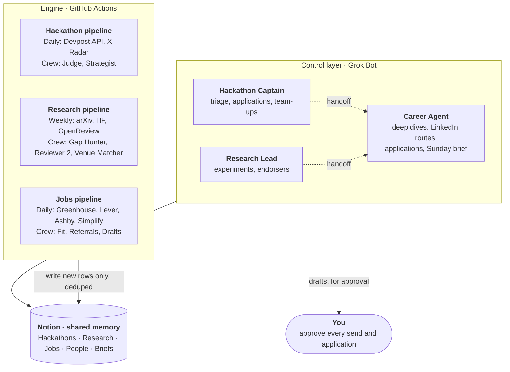

# **Agent Boards Blueprint**

Sep 27, 2026 · @Nissan Dutta

## **Verdict: yes to CrewAI, but only as the engine**

Yes, CrewAI runs on Grok. But Grok Bot already is your manager layer: Bots are the agents, group chats are the crews, routines are the scheduler. Put CrewAI underneath it, doing the bulk scanning that would burn your Bot usage.

* **CrewAI → Grok works today.** CrewAI 1.15.22 reaches Grok through xAI's OpenAI-compatible endpoint: LLM(model="grok-4.3", provider="openai", base\_url="https://api.x.ai/v1"). I tested it. The xai/ shortcut fails unless you add the LiteLLM extra.  
* **Grok Bot does the manager's job.** Each Bot has a name and a job, and all Bots share one cloud computer (browser, files, terminal). You also get skills, up to 50 routines per Bot, Bot-to-Bot messages, group chats of 2–6 Bots, and approval gates. Access comes with paid Cursor plans or a linked SuperGrok / X Premium+.  
* **Why split the work.** Right now the Simplify list alone has about 2,000 internships, and xAI and OpenAI post 276 and 830 roles. Having a browsing agent read all that every day eats weekly usage and breaks often. Public APIs return it for free, so Grok only needs to judge the top \~25.

| Layer | Runs on | Its job | Cost |
| :---- | :---- | :---- | :---- |
| Control | Grok Bot: 3 Bots (Hackathon Captain, Research Lead, Career Agent) | Judgment, login-gated browsing (LinkedIn), drafts, approvals | Your Grok Bot weekly usage |
| Engine | This repo on GitHub Actions cron | Scouts, filters, CrewAI crews, Notion sync | About \$10–20/month of xAI API (estimate) |
| Memory | Notion | 3 board databases \+ People, weekly briefs and an Engine status page | Free |

Models: grok-4.3 (\$1.25 in / \$2.50 out per 1M tokens, 1M context) does the bulk scoring. grok-4.7 (\$2 / \$6) does live search and strategy. Web search and X search each cost \$5 per 1,000 calls ([xAI pricing](https://docs.x.ai/developers/pricing)).

## **Architecture: 3 Bots on top, 3 pipelines underneath, Notion in the middle**

System architecture · 2 layers, 3 Bots, 3 pipelines, 1 shared memory

The pipelines scan everything each day and write only new, scored rows to Notion. The Bots read Notion, do the work that needs a browser or judgment, and stop for your approval before anything goes out.

* **Sub-agents in Grok Bot are skills, at first.** xAI's own advice is to begin with the smallest roster that works. Each Bot starts with 2–4 skills as its sub-agents. A skill becomes its own Bot only once it has a steady specialist job. The likely first one is a shared Outreach Writer.  
* **Sub-agents in the engine are CrewAI agents.** Each pipeline runs deterministic scouts first, then a small sequential crew on the top candidates.  
* **One War Room group chat** holds all 3 Bots (the cap is 6, which leaves room for a shared Outreach Writer later), so a hackathon sponsor can move straight into a job lead.  
* **Notion holds the truth.** xAI's docs warn that Bot memory is not an authoritative source, so status, deadlines and scores live in Notion.

## **Three rules that keep it working**

1. **Start sub-agents as skills.** Only promote one to its own Bot when it has a steady job of its own. The likely first is an Outreach Writer shared by all three Bots, once you know your voice.
2. **One Notion database per Bot, and Notion is the truth.** The engine only adds new rows. The Bots own the Status column.
3. **Handoffs between Bots.** If a hackathon sponsor or a paper's author works at one of your target companies, the Captain or the Research Lead passes the name to the Career Agent.

**No Chief of Staff.** Three Bots are enough. The Sunday brief is one weekly routine on the Career Agent, which runs most often and already receives every handoff. It can move to any one Bot.

Everything for the three Bots is in [`grokbot/`](../grokbot/): the Bot descriptions to paste in (`bots/`), all the skills (`skills/`) and the routines (`routines.md`).

## **Hackathon Board: score events by who you'll meet, not by the prize**

This board catches company-run events early and keeps your application ready. The hard part is timing, not finding them. xAI's [Grokathon](https://x.ai/grokathon) is a good example: 12 hours in person in San Francisco, entry by application, a July 28 deadline, and only [16 participants](https://spacexai-grokathon.devpost.com/). Events like that go out on X first, so X search is where Grok has the edge.

| Sub-agent | Runs in | Does | Output |
| :---- | :---- | :---- | :---- |
| Devpost Scout | Engine, plain code | Pulls every open online hackathon each day from Devpost's public API (68 listed today) | Raw rows |
| X Radar | Engine, Grok web \+ X search | Catches company-run events that Devpost misses: Grokathons, buildathons, bounties and kernel contests from xAI, Anthropic, OpenAI, Cursor, lablab.ai and Cerebral Valley | Extra rows |
| Judge | Engine crew, grok-4.3 | Scores the top 25 by hiring signal, fit with your work and reach, using the rubric below | Score 0–100, reasons, eligibility flags |
| Strategist | Engine crew, grok-4.7 | Plans how to win the top 3, reusing EvalCI or agent-eval-harness | Project pitch, 48-hour plan, people to meet |
| Triage | Hackathon Captain skill | Reads the real event page, confirms eligibility, then shortlists it or skips it | Shortlist / Skipped with a reason |
| Application Packer | Hackathon Captain skill | Fills in gated applications from your proof pack and stops before Submit | Filled form for you to approve |
| Team-up Scout | Hackathon Captain skill | Scans the event's Discord and X replies for people who fill your gaps | 2–3 teammates, intro drafts |

| Rubric factor | Weight | What earns points |
| :---- | :---- | :---- |
| Hiring signal | 30 | Hosts, sponsors or judges from your target companies |
| Thesis fit | 25 | Evals, inference, agents, statistical rigor |
| Reach | 20 | Online, or in person with travel covered. In person without travel is a hard gate. |
| Runway | 15 | 7 or more days before the deadline |
| Payoff | 10 | Prizes, credits, early API or model access |

The board also tracks remote competitions such as Kaggle, GPU MODE kernel contests and Prime Intellect bounties. These get you in front of hiring engineers without needing a visa or a flight.

## **Research Board: reanalysis papers are the solo path that fits you**

The fastest route to a publication without a lab is reanalysis. Take eval results people have already published, rerun them with EvalCI's bootstrap CIs and McNemar tests, and report which gains hold up. It needs little compute, the data is public, and it shows off your own tool. This board finds the papers worth reanalyzing, matches them to venues that are open, and deals with the gatekeeping around them.

| Sub-agent | Runs in | Does | Output |
| :---- | :---- | :---- | :---- |
| Paper Radar | Engine, plain code | Pulls new arXiv papers (cs.CL, cs.LG, stat.ML) and Hugging Face daily papers, filtered on eval keywords | Reading queue |
| CFP Radar | Engine, plain code | Lists open workshop calls and their deadlines from OpenReview (119 NeurIPS 2026 workshops are listed) | Open venues with due dates |
| Gap Hunter | Engine crew, grok-4.3 | Flags headline gains with weak statistics: no CI, a single seed or a small test set | Reanalysis ideas, with data and compute cost |
| Reviewer 2 | Engine crew, grok-4.7 | Tries to kill each idea before it costs you a submission slot: novelty, threats, the one experiment that could kill it | Go / fix / kill |
| Venue Matcher | Engine crew, grok-4.3 | Matches each surviving idea to an open call, TMLR, or a reproducibility track | Idea → venue → deadline |
| Experiment Runner | Research Lead skill | Reproduces the paper's numbers, then reanalyzes them with EvalCI (bootstrap CIs, McNemar) on the Bot's computer | Repro table, reanalysis, logged commands |
| Endorser Scout | Research Lead skill | Finds established arXiv authors in your subfield who could endorse your first paper | Endorsement request draft, for your approval |

Gatekeeping rules the board plans around:

* **arXiv endorsement.** Since [January 21, 2026](https://blog.arxiv.org/2026/01/21/attention-authors-updated-endorsement-policy/), an institutional email alone no longer qualifies a first-time submitter. Independent authors need a personal endorsement from an established author, which is why the Endorser Scout exists.  
* **TMLR quota.** [Solo authors get 2 submissions a year](https://medium.com/@TmlrOrg/annual-author-submission-quotas-for-tmlr-1db785e51548), counted from January 1, 2026, and desk rejects count too. Reviewer 2 has to pass an idea before it uses one of your slots. Adding a coauthor such as Bhone raises the cap.  
* **Reproducibility tracks.** [MLRC 2026](https://blog.neurips.cc/2026/05/04/mlrc-2026-reproducibility-as-an-official-track-at-neurips/) became an official NeurIPS track through TMLR, with papers presented in Sydney. This year's cutoff was September 30, 2026\. The CFP Radar will flag the next cycle when it opens.

**Live find from today's test run.** The CFP Radar found 5 calls that are still open. The best fit is the [Predictive AI Evaluation Competition](https://aimslab.stanford.edu/competition) at NeurIPS 2026\. You build a predictor of whether a model will answer a benchmark item correctly, without running the model. It's open to individuals regardless of affiliation, final submissions close October 30, 2026 (AoE), and the top entries present in Sydney. It sits squarely on your eval thesis, so it's a competition, a paper and a hiring signal in one entry.

## **Jobs & Internships Board: read company job boards directly, then chase the hidden doors**

This board reads the public job APIs of 40 target companies once a day. It also hunts for the roles people overlook, which is where your odds are best: residencies, open applications and remote generalist roles. Three live examples from today's scan:

* RadixArk (the SGLang team) has an "AI Infra Resident (1-Year Program)".  
* Inferact (the vLLM team) has an "Exceptional Generalist (Remote)" role.  
* Prime Intellect has an "Open Application for Unconventional Talent".

| Sub-agent | Runs in | Does | Output |
| :---- | :---- | :---- | :---- |
| ATS Scout | Engine, plain code | Reads 40 company job boards on Greenhouse, Lever and Ashby (xAI 276 roles, Anthropic 618, OpenAI 830), plus Simplify's internship and new-grad lists | Raw postings |
| Pre-filter | Engine, plain code | Filters by title, location (US, Japan, Singapore, remote) and freshness, and flags eligibility problems | Today: about 7,900 postings → 1,100 matches → top 25 |
| Fit Scorer | Engine crew, grok-4.3 | Scores each posting against profile.yaml and picks the angle to lead with | Fit 0–100, eligibility flags, your angle |
| Referral Mapper | Engine crew, grok-4.7 \+ X search | For the top 5, finds engineers on the team who post on X, plus something recent of theirs to mention | 2–3 names and hooks |
| Outreach Drafter | Engine crew, grok-4.3 | Writes a message under 110 words and suggests resume edits | Drafts only, never sent |
| Deep Dive | Career Agent skill | Checks the real posting, confirms the flags and rewrites the draft | Checked row, rewritten draft |
| LinkedIn Mapper | Career Agent skill | Finds alumni (UWC, Goucher) and mutual-connection routes, read-only, under your login through Grok Bot's browser handoff | Warm routes in Contacts |
| Application Filler | Career Agent skill | Fills in the ATS form and stops before Submit | Filled form, waiting for your approval |

Eligibility flags are shown on the row, never used to drop it silently: needs current enrollment, sponsorship stated or refused, degree requirement, location. You decide which ones rule a role out. Status moves New → Shortlist → Drafted → Applied → Interview → Offer or Closed.

Companies are grouped as inference infra (Inferact, RadixArk, Fireworks, Baseten, Together, Modal, Cerebras, Etched, Lambda, CoreWeave), labs (xAI, Anthropic, OpenAI, Thinking Machines, Cohere, Perplexity), eval and agent tooling (Braintrust, Prime Intellect, Scale AI, LangChain, Exa), and Japan or Singapore (PayPay, Ninja Van). DeepInfra has no public job feed, so the X Radar watches its careers page instead.

## **Notion workspace: three board databases, People, Briefs and Engine status, built by one command**

You share one empty Notion page with the integration. python \-m boards setup-notion then builds everything under it and saves the IDs to notion\_ids.json. IDs aren't secrets, so the only secrets are the two API keys. Every row has a Key (a hash of source \+ ID), so reruns never create duplicates.

| Database | Title | Key properties | Status flow |
| :---- | :---- | :---- | :---- |
| Hackathons | Event name | Score, Deadline, Dates, Format (Online / In person / Hybrid), Host, Source, URL, Why, Plan, Flags, Found, Status changed | New → Shortlist → Applying → Building → Submitted / Skipped |
| Research | Paper, idea or call | Type (Paper / Idea / CFP), Score, Deadline, Venue, URL, Summary, Verdict (Go / Fix / Kill), Found, Status changed | New → Reading → Pursuing → Drafting → Submitted / Parked |
| Jobs | Role · Company | Company, Score, Location, Flags, URL, Why, Contacts, Draft, Source, Posted, Found, Deadline (only when the posting states one), Status changed | New → Shortlist → Drafted → Applied → Interview → Offer / Closed |
| People | Name | Handle/URL, Company, Role, Source, Source row, Hook, Handed off, Linked jobs (relation to Jobs), Key (company \+ handle) | n/a. Bots write it: handoffs from the Captain and Research Lead, linked by the Career Agent |
| Briefs | Weekly brief · date | A page per week: top 3 moves per board, deadlines in the next 14 days, stale items, what you advanced, and a Status snapshot table for next week's diff | n/a |
| Engine status | One page | Per pipeline: last successful run time, rows added, sources that failed. The engine overwrites it on every run | n/a |

The engine only ever creates rows and fills in empty fields. It never touches Status or Status changed, which belong to you and your Bots. A Bot sets Status changed to today whenever it changes Status. If you change Status by hand in Notion, set it too, or add a Notion database automation that does it for you, where your plan supports that. The Sunday brief also diffs each week's Status snapshot, so moves are counted even when the date is missing. This is what lets the Bots and the pipelines share one database without overwriting each other.

## **Schedules and cost: about \$17 a month at defaults, about \$8 on the lean setting**

Each pipeline runs before its Bot routine, so a Bot always wakes up to fresh rows. Times are UTC, with New York time in brackets. Change the cron lines in .github/workflows/ to suit your hours.

| Run | Engine schedule | Bot routine that follows | Est. xAI cost per run |
| :---- | :---- | :---- | :---- |
| Jobs | Daily 10:17 (6:17 AM) | Career Agent, weekdays 8:00 AM: triage New, draft for Shortlist | \$0.35 |
| Hackathons | Daily 10:37 (6:37 AM) | Hackathon Captain, daily 8:30 AM: check deadlines, prep applications | \$0.19 |
| Research | Mondays 11:07 (7:07 AM) | Research Lead, Mondays 9:00 AM: pick one idea, push it one stage | \$0.13 |
| Weekly brief | Sundays 22:07 (6:07 PM) | Career Agent, Sundays 7:00 PM: brief in the War Room | \$0.03 |

Monthly: 30 × (\$0.35 \+ \$0.19) \+ about 4 × \$0.16 ≈ **\$17**. These are estimates from token counts, including CrewAI's prompt overhead. Your first week's xAI bill is the real number. Most of the cost is live search (web and X search at \$5 per 1,000 calls), so the lean setting in config.yaml gets you to about \$8. It runs Referral Mapper only on scores of 75 or more and runs X Radar every other day.

GitHub Actions: 4 workflows use about 350 minutes a month. That's free on a public repo and inside the [2,000 free minutes](https://docs.github.com/billing/managing-billing-for-github-actions/about-billing-for-github-actions) for a private one. Keep it private, because profile.yaml holds your personal targets.

## **Setup: about 45 minutes, and you never need Python on your laptop**

Everything runs in GitHub's cloud and in Grok Bot. Your laptop only needs a browser.

* ☐ **xAI key.** Create one at console.x.ai and add \$10 of credit.  
* ☐ **Notion.** Make an internal integration and copy its token. Create an empty page called "Agent Boards", then share it with the integration (••• → Connections).  
* ☐ **Repo.** Make a private GitHub repo and upload the agent-boards folder. Add two secrets under Settings → Secrets → Actions: XAI\_API\_KEY and NOTION\_TOKEN.  
* ☐ **Build Notion.** Go to Actions → "Setup Notion" → Run workflow, and paste the page URL. It builds the databases (Hackathons, Research, Jobs, People, Briefs) and the Engine status page, then commits notion\_ids.json.  
* ☐ **Profile.** Edit profile.yaml: your skills, projects, target roles, locations and dealbreakers. Everything the scorers do depends on this file.  
* ☐ **Dry run.** Run each board workflow once with dry\_run ticked. It writes a report to the run summary and never touches Notion. Untick it for the real run.  
* ☐ **Grok Bot.** Create the 3 Bots by pasting from grokbot/bots/. Install the Notion connector from Marketplace. Save the skills in grokbot/skills/, set up the routines in grokbot/routines.md, then open the War Room group chat.  
* ☐ **After one week.** Compare the xAI bill with the estimate, and adjust the rubric weights in config.yaml based on which rows you actually acted on.

If you'd rather test on your laptop first, use python \-m boards run jobs \--dry-run \--mock. It runs the whole pipeline on live data with fake LLM calls, for \$0 and with no keys.

## **Guardrails: agents find and draft, you send**

Nothing leaves your hands without a click from you. The engine has no code at all for sending email, DMs or applications. In Grok Bot, add Auto-Review "Ask first" rules for sending, submitting forms, publishing and accepting terms. Per xAI's docs, "Ask first" wins when two rules conflict.

* **LinkedIn goes through the Bot only.** The engine never scrapes it. The Career Agent reads it under your own login, at human speed, and never writes anything.  
* **Drafts are starting points.** An LLM cold email reads like one. Each draft carries one specific hook, and you rewrite the first line yourself.  
* **Scores are opinions.** The weights start as guesses, and the weekly brief shows what you acted on so you can retune them.  
* **Research integrity is fixed.** Agents find gaps and plan experiments. They never write results or claims. Every number in a paper comes from code you ran. arXiv tightened endorsement in 2026 because of a flood of "non-scientific submissions", so one fabricated number would cost you far more than a slow month.  
* **Grok Bot is in beta** (launched August 2026), and its weekly usage allowance isn't published as a number. The engine doesn't depend on it, and switching models takes one line in config.yaml. If Grok Bot's pricing changes, the pipelines keep running.  
* **Sources break one at a time.** Each scout fails on its own and reports in the run summary. If arXiv is down, the Paper Radar still gets Hugging Face daily papers.

## **Roadmap: turn the system itself into your shipped artifact**

| Phase | When | What ships | Gate to the next phase |
| :---- | :---- | :---- | :---- |
| Run it | Week 1 | Engine and 3 Bots live. Dry runs, then real runs. Tune profile.yaml | 10 rows you acted on |
| Tune it | Weeks 2 to 4 | Scorers learn from your Status changes. Add the Outreach Writer | Top 10 beats a keyword filter |
| Ship it | Month 2 | Open-source the engine. Share the Bot template. Post the build on X | 50 outside users run it |
| Publish it | Month 3 | Grade the agents with EvalCI. Paper plus a YC artifact | n/a |

One artifact pays off on all three boards by month 3.

The bigger move is that this engine is itself a product. Open-source it, let other students run it, and then grade its recommendations with EvalCI. For example: does its top 10 beat a keyword filter, with bootstrap CIs? That one piece of work covers all three boards at once. It's a public artifact with real users (the gap in your last YC application), a workshop or TMLR paper, a portfolio project for inference and eval roles, and a demo for your next hackathon.

## **Sources**

* [Grok Bot overview](https://docs.x.ai/grok-bot/overview), [skills and routines](https://docs.x.ai/grok-bot/skills-routines-and-automations), [collaboration](https://docs.x.ai/grok-bot/chat-and-collaboration), [approvals](https://docs.x.ai/grok-bot/approvals-security-and-privacy), [plans](https://cursor.com/help/grok-bot/plans)  
* [xAI API pricing](https://docs.x.ai/developers/pricing), [xAI server-side tools](https://docs.x.ai/developers/tools/overview), [web and X search](https://docs.x.ai/docs/guides/tools/search-tools)  
* [CrewAI LLM docs](https://docs.crewai.com/en/concepts/llms), [LiteLLM xAI provider](https://docs.litellm.ai/docs/providers/xai)  
* [Notion API 2025-09-03 upgrade guide](https://developers.notion.com/docs/upgrade-guide-2025-09-03)  
* [Grokathon](https://x.ai/grokathon), [SpaceXAI Grokathon on Devpost](https://spacexai-grokathon.devpost.com/)  
* [arXiv endorsement policy, Jan 2026](https://blog.arxiv.org/2026/01/21/attention-authors-updated-endorsement-policy/), [TMLR author quotas](https://medium.com/@TmlrOrg/annual-author-submission-quotas-for-tmlr-1db785e51548), [MLRC 2026 at NeurIPS](https://blog.neurips.cc/2026/05/04/mlrc-2026-reproducibility-as-an-official-track-at-neurips/)  
* [GitHub Actions billing](https://docs.github.com/billing/managing-billing-for-github-actions/about-billing-for-github-actions)  
* Live counts (68 Devpost events; 276 xAI, 618 Anthropic and 830 OpenAI roles; 119 NeurIPS 2026 workshops) come from the public APIs, checked September 27, 2026\.
